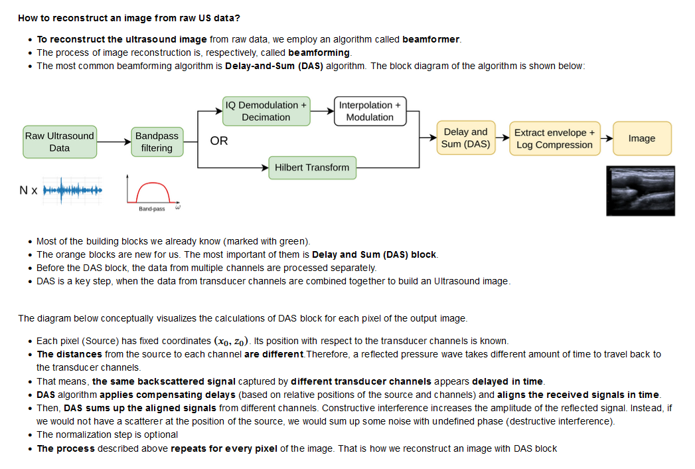

# Beamforming PROJECT
General idea: A-mode ultrasound data from many neighboring transducers. Reconstructing these signals into images is called B-mode ultrasound. We know the depth from where the reflections originate, and should be able to attribute each change in propagation speed (of send out soundwave) at tissue borders to one transducer. 

Beamforming with DAS (Delay-and-Sum):
- [Delay and Sum](<media/delay and sum.png>) concept image. The delays to each transducer from the source can create a focused and directed beam of ultrasound. Transducers are sending pulses and listening for reflections, thus serving as actuator and sensor at the same time. During B-mode imaging, the signals arriving at transducers from the same reflected object (but with slightly different delays) are "shifted" to overlap and summed together to get high amplitude signal. 

- [Polybox Link](https://polybox.ethz.ch/index.php/apps/files/?dir=/WUPS%20Project&fileid=3513953695)

## Git and GitHub

I found [this](https://medium.com/@jonathanmines/the-ultimate-github-collaboration-guide-df816e98fb67#:~:text=How%20to%20Collaborate%20on%20GitHub%201%20%20Step,Repeat.%20And%20that%E2%80%99s%20pretty%20much%20it%21%20See%20More.) short but nice rundown of how to collaborate using Git. 

# Roadmap

The BIG steps until project completion:

- [ ] Understand beamforming
- [ ] Setup Project Roadmap
- [ ] Reconstructing Images from PICMUS dataset
    - [ ] naive method (straigth beam into tissue with reflections)
    - [ ] summation from different angles to cancel out noise
- [ ] Presentation
    - [ ] decide what data we want to have presentable in the end

## Trello

I am currently working on migrating these [ToDos to trello](https://trello.com/b/LNgm3pRo), because Kanban is the better tool for project planning imo

