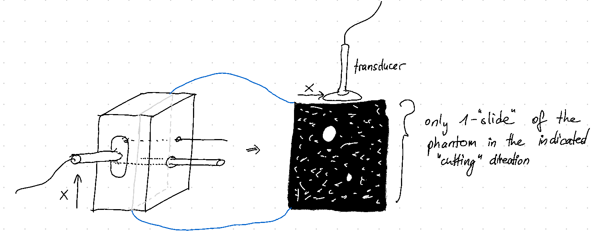
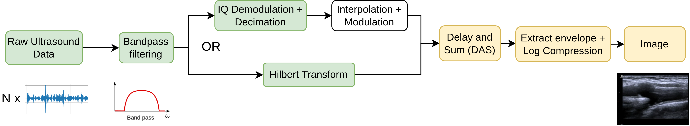

# Concept Note: Beamforming

## Overview
<!-- Provide a brief overview of the concept, highlighting its purpose and significance.-->

Transducer-array produces a "beam" of ultrasound (a plane of ultrasound) and "scans" a slice of the object. The recorded data then can be used to create the 2D brightness image that is known as B-mode. This process is called Beamforming. 

## Key Features
<!-- [Enumerate the key features or characteristics of the concept.] -->

- 2D image
- visualize a big area
- relatively simple

## Implementation
<!-- [Outline the steps or process required to implement the concept.] -->

- Algortihm called **Beamformer** takes raw ultrasound data from a transducer array and performs steps to filter, extract envelope, combine individual transducers, and render image (See [Beamforming Delay and Sum](beamforming_DAS.md) note for more info)
- another algorithm: [Compounding Imaging]()
- important statistical concept is the **covariance matrix**. It is an estimate of the influence different channel-pairs have on their signals (how strongly channel 1 affects channel 2). The inverse of this matrix is used in algorithms like MVDR (minimum variance distortionless response) and Capon beamformers. 

## Use Cases
<!-- [Provide examples or scenarios where the concept can be applied.] -->

- B-mode ultrasound is used everywhere in hospitals to visualize the inside of the body

## Challenges
<!-- [Identify any potential challenges or obstacles that may arise during the implementation of the concept.] -->

- Requires lots of computation?
- sources of [noise in beamforming](<noise in beamforming.md>)