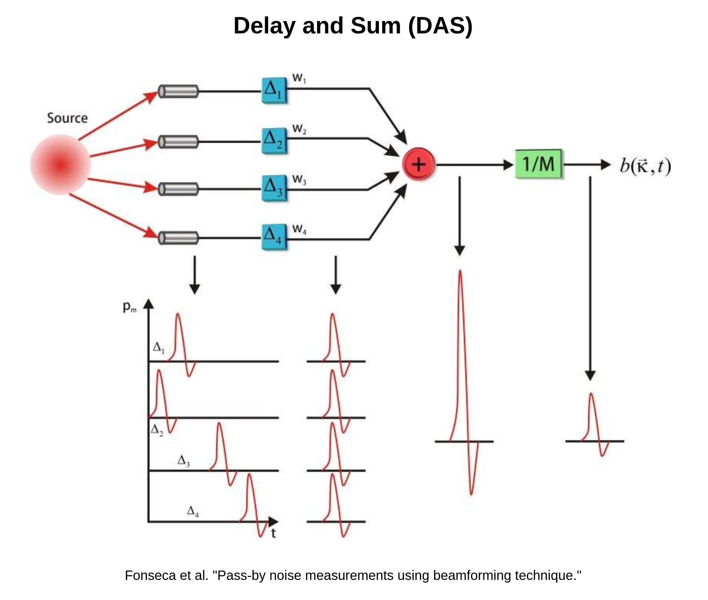

# Concept Note: Delay and Sum

## Overview
<!-- Provide a brief overview of the concept, highlighting its purpose and significance.-->

The diagram above conceptually visualizes the calculations of DAS block for each pixel of the output image.
- Each pixel (Source) has fixed coordinates $(x_0, z_0)$. Its position with respect to the transducer channels is known.
- **The distances** from the source to each channel **are different**. Therefore, a reflected pressure wave takes different amount of time to travel back to the transducer channels. 
- That means, **the same backscattered signal** captured by **different transducer channels** appears **delayed in time**.
- **DAS** algorithm **applies compensating delays** (based on relative positions of the source and channels) and **aligns the received signals in time**.
- Then, **DAS sums up the aligned signals** from different channels. Constructive interference increases the amplitude of the reflected signal. Instead, if we would not have a scatterer at the position of the source, we would sum up some noise with undefined phase (destructive interference).
- The normalization step is optional
- **The process** described above **repeats for every pixel** of the image. That is how we reconstruct an image with DAS block
    - Each pixel has fixed coordinates, thus we know the **depth** and the **position** from where we want to "listen" for backscatters

## Benefits
<!-- Describe the potential benefits or advantages of implementing the concept.-->

- Simplest beamforming method

## Implementation
<!-- Outline the steps or process required to implement the concept.-->

### Mathematics

WIP...

### Additional Stuff
DAS beamforming can additionally use **apodization** after the delay, which determines how much each channel contributes to the summed result. "Apodization is known as an important factor that determines image quality" [[1]](#1)
- Imagine that we weigh all transducers equally, the transducers at the edges receive the most reflections from [side lobes](<side lobes.md>) and contribute a lot of noise to the final sum.
- Adaptive beamforming tries to find out the best *weights* for apodization to create an image with high resolution and contrast.

# Resources
<a id="1">[1]</a> 
Hasegawa, H. (2017). Apodized adaptive beamformer. Journal of Medical Ultrasonics, 44(2), 155–165. https://doi.org/10.1007/s10396-016-0764-3